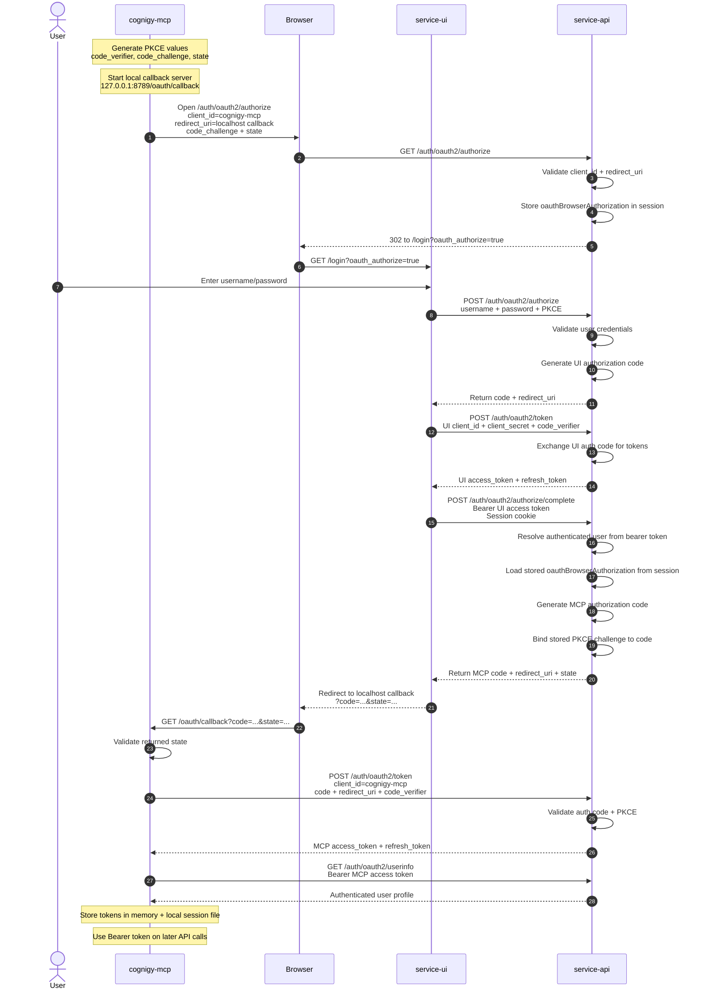

# Cognigy MCP OAuth Sequence Diagram

## Notes

- `service-api` is the OAuth authorization server and token issuer.
- `service-ui` is the browser login surface and OAuth flow helper.
- `cognigy-mcp` is a public PKCE client and does not use a client secret.
- The `authorize/complete` step requires both:
  - a bearer token to identify the authenticated user
  - a browser session cookie to recover the stored OAuth authorize request
