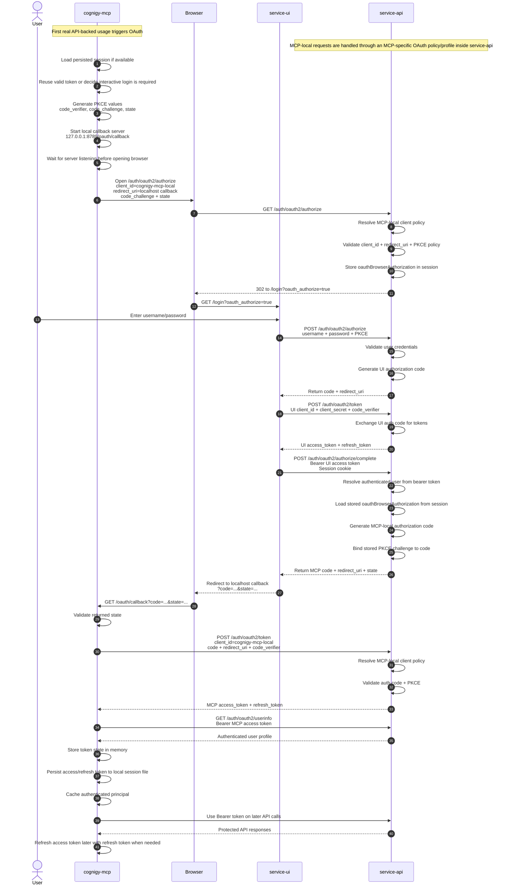
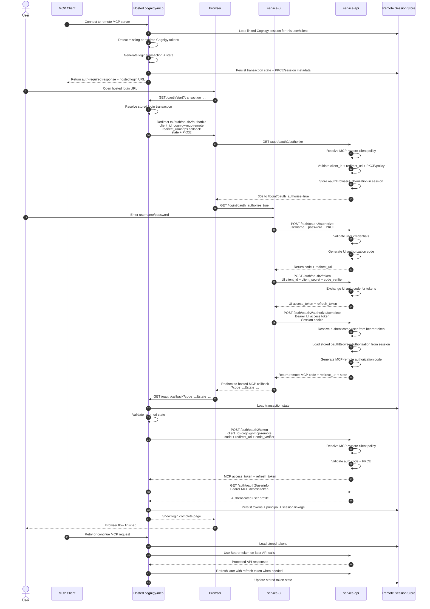

# Cognigy MCP OAuth Sequence Diagram

## Notes

- `service-api` is the OAuth authorization server and token issuer.
- `service-ui` is the browser login surface and OAuth flow helper.
- `cognigy-mcp-local` is the local MCP public PKCE client and does not use a client secret.
- In the target architecture, MCP requests are routed through an MCP-specific OAuth profile/policy layer inside `service-api`, while the shared token engine remains reusable for other consumers.
- The `authorize/complete` step requires both:
  - a bearer token to identify the authenticated user
  - a browser session cookie to recover the stored OAuth authorize request

## Hosted Remote MCP Variant

If `cognigy-mcp` is hosted remotely, the OAuth owner changes from "the MCP process on the user's machine" to "the hosted MCP service".

## Key Differences For Hosted Remote MCP

1. Callback ownership
   - Local today: browser redirects to `127.0.0.1:8789/oauth/callback`.
   - Remote: browser redirects to a hosted HTTPS endpoint owned by the remote MCP service.

2. Browser launch
   - Local today: `cognigy-mcp` opens the browser itself.
   - Remote: the MCP client receives an auth-required response and the user opens the hosted login URL.

3. Token storage
   - Local today: access and refresh tokens are stored in a local per-user session file.
   - Remote: tokens must be stored server-side in an encrypted shared store.

4. Session correlation
   - Local today: the same local process owns PKCE values, callback handling, and token exchange.
   - Remote: the hosted MCP service must persist transaction state so the browser login can be linked back to the right remote MCP session.

5. Runtime model
   - Local today: mostly single-user process state plus local disk persistence.
   - Remote: multi-user, multi-instance service with shared session/token storage and refresh coordination.

6. Client identity and policy
   - Local today: one local MCP public client profile is used for localhost callbacks.
   - Remote: hosted MCP should use a distinct remote client profile so redirect URI, scope, and future confidential-client policy can evolve independently.

## MCP Responsibilities

`cognigy-mcp` is active in multiple phases of the flow:

1. Before browser login
   - decides whether a persisted session can be reused
   - generates `state`, `code_verifier`, and `code_challenge`
   - starts the localhost callback server

2. During browser login
   - waits for the browser callback on the configured redirect URI
   - validates that the returned `state` matches the original request

3. After browser login
   - exchanges the authorization code for access and refresh tokens
   - fetches `userinfo`
   - stores tokens locally for reuse

4. On later prompts
   - sends bearer tokens on protected requests
   - refreshes the access token silently when possible
   - falls back to interactive login only when refresh or reuse is no longer possible

## Responsibility Shift In A Remote Deployment

When `cognigy-mcp` is hosted remotely, these responsibilities move:

- Local callback server -> hosted HTTPS callback endpoint on the remote MCP service
- local token file -> server-side token/session store
- local in-process PKCE state -> persisted login transaction owned by the remote MCP service
- "open the browser now" behavior -> auth challenge or login URL returned to the MCP client
- single local user session -> multi-tenant session linkage between MCP client, browser login, and Cognigy identity
- shared generic client checks -> MCP-specific client policy for `cognigy-mcp-local` and `cognigy-mcp-remote`
