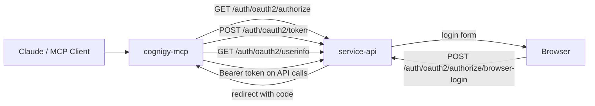
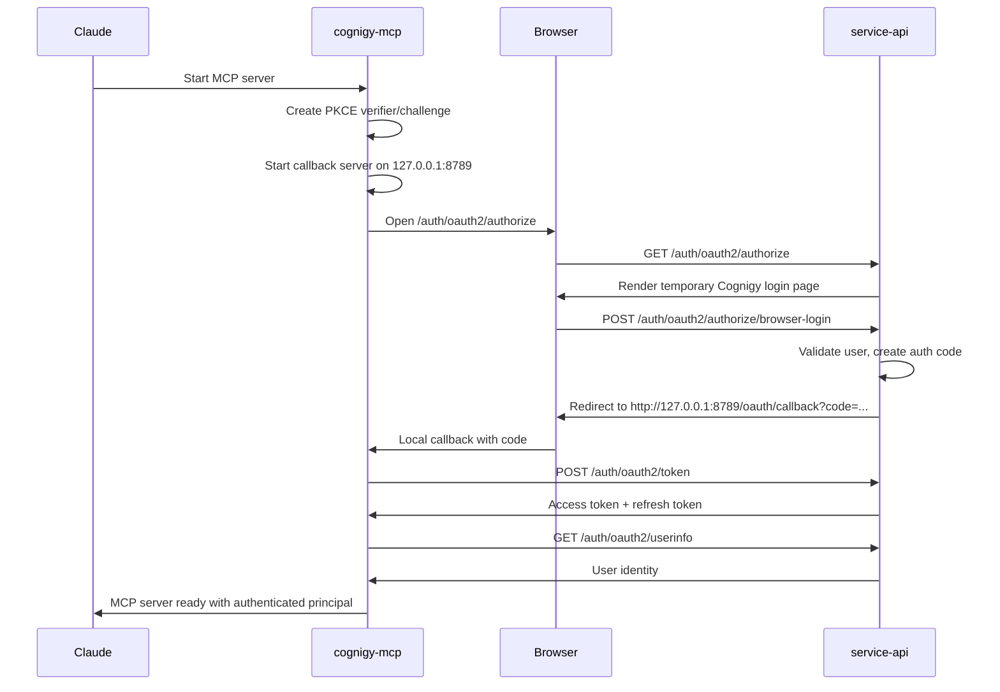

# Cognigy MCP OAuth V1 Handover

## Purpose

This document captures the current V1 OAuth implementation for:

- `cognigy/services/service-api`
- `cognigy-mcp`

It is meant as:

- a handover summary of what was implemented
- a record of temporary fixes and local-debug workarounds
- a starting context file for the future V2 implementation

V1 goal was:

- get Cognigy MCP working with OAuth using the least risky path
- keep `cognigy-mcp` standalone
- reuse `service-api` as the Cognigy-owned auth authority

It is **not** the final architecture.

---

## V1 Outcome

What works now:

- `cognigy-mcp` can start an OAuth Authorization Code + PKCE flow against `service-api`
- `service-api` can issue an authorization code for the MCP client
- `cognigy-mcp` can receive the local callback on `127.0.0.1:8789`
- `cognigy-mcp` can exchange the code at `/auth/oauth2/token`
- `cognigy-mcp` can call `/auth/oauth2/userinfo`
- `cognigy-mcp` can derive an authenticated principal from Cognigy user info

This was verified with logs showing:

- callback server started
- callback validated
- token exchange succeeded
- userinfo succeeded
- MCP server started with authenticated user context

---

## High-Level Architecture

### Runtime Flow

---

## Main Code Changes

## `service-api`

Main files changed:

- `services/service-api/src/auth/oauth2/oauth2ApiRouter.ts`
- `services/service-api/src/auth/oauth2/browserAuthorization.ts`
- `services/service-api/src/auth/oauth2/userinfo.ts`
- `services/service-api/src/auth/oauth2/authorizationCodeFlow.ts`
- `services/service-api/src/auth/oauth2/getClient.ts`
- `services/service-api/src/auth/utils/config.ts`
- `services/service-api/src/auth/utils/createClients.ts`
- `services/service-api/src/helper/validateClient.ts`
- `services/service-api/src/spec/auth/oauth2/saveAuthorizationCode.spec.ts`

Main changes:

- added GET browser-based authorize route
- added POST browser-login route
- added `userinfo` endpoint for MCP token validation / principal lookup
- added MCP client config support:
  - `CLIENT_ID_COGNIGY_MCP`
  - `REDIRECT_URI_COGNIGY_MCP`
  - `ALLOWED_SCOPES_COGNIGY_MCP`
- added MCP OAuth client registration in startup client creation
- treated MCP as a PKCE client
- allowed authorization-code token exchange without client secret
- fixed `getClient()` so empty `client_secret` does not break public-client lookup

## `cognigy-mcp`

Main files changed:

- `src/auth/oauthAuthProvider.ts`
- `src/auth/apiKeyAuthProvider.ts`
- `src/auth/createAuthProvider.ts`
- `src/auth/types.ts`
- `src/api/client.ts`
- `src/config.ts`
- `src/index.ts`
- `src/__tests__/config.test.ts`
- `src/__tests__/createAuthProvider.test.ts`
- `manifest.json`
- `src/cli/init.ts`
- `env.template`
- `claude_desktop_config.example.json`
- `cursor_mcp_config.example.json`

Main changes:

- introduced auth abstraction for:
  - API key auth
  - OAuth auth
- added browser-based Authorization Code + PKCE flow
- added local callback listener on `127.0.0.1:8789`
- added token exchange and `userinfo` lookup
- normalized authenticated principal:
  - user id
  - organisation id
  - email / name
  - scopes
- updated install/config surfaces for OAuth env vars
- added handling for unresolved installer placeholder values such as `${user_config.cognigy_organisation_id}`
- added detailed MCP-side OAuth logs for debugging

---

## V1-Specific Temporary Logic

These are the parts that solved V1 but are not the final design.

## 1. Temporary login page in `service-api`

Current behavior:

- `service-api` serves a very small HTML login form from `browserAuthorization.ts`

Why this was done:

- fastest way to make browser-based OAuth work locally
- avoided deeper reuse of the full existing Cognigy UI login/session flow

Why it should be replaced in V2:

- it does not reuse the real Cognigy login UX
- it does not reuse full SSO / login routing behavior
- it creates a second login surface

V2 target:

- redirect into the main Cognigy login flow instead of rendering this mini form

## 2. CSP workaround for the browser login page

Problem:

- the temporary login form submit was blocked by browser CSP

V1 fix:

- removed CSP headers on that tiny local browser auth page

Why this is temporary:

- this is only acceptable as a narrow V1 workaround
- it should not remain as the long-term solution

V2 target:

- remove the custom form page entirely
- let the real Cognigy login page handle CSP correctly

## 3. Public PKCE client compromise in token handling

Problem:

- underlying `oauth2-server` requires client authentication by default for token grants

V1 fixes:

- `requireClientAuthentication.authorization_code = false`
- `getClient()` ignores empty / missing `client_secret`

Why this is important:

- this enables `cognigy-mcp` as a public client without a client secret

Why this is not ideal:

- `authorization_code` is now relaxed at the grant-type level
- better long-term behavior is more client-aware and explicit

V2 target:

- make public-client vs confidential-client behavior explicit and robust
- ideally avoid a broad grant-level relaxation if a more precise mechanism is possible

## 4. Eager auth on MCP startup

Current behavior:

- `cognigy-mcp/src/index.ts` calls `await authProvider.getPrincipal()` during startup

Effect:

- starting the server immediately triggers OAuth login

Why this is not ideal:

- the server should normally authenticate lazily on first real tool use
- this makes startup behavior noisy and harder to integrate

V2 target:

- remove startup-eager auth
- authenticate lazily when tools/resources actually need a token

## 5. In-memory token storage only

Current behavior:

- access token / refresh token are stored only in process memory

Effect:

- if MCP process restarts, login is needed again

Local persistence follow-up target:

- persist tokens for current local `cognigy-mcp` distributions only (`npm`, `.mcpb`, other user-run local MCP processes)
- keep the implementation scoped to `cognigy-mcp` so `service-api` and other OAuth consumers are unaffected
- reuse the refresh token across local restarts and silently refresh access tokens until the refresh token expires or is revoked
- store the local session in a restricted per-user file, keyed by issuer/client/redirect/org

Out of scope for this local step:

- hosted/remote MCP deployments such as `mcp.cognigy.ai`
- mobile-specific secure storage integrations
- any `service-api` behavior change

Future expansion note:

- a hosted MCP deployment would need a different callback/session model owned by the hosted MCP service rather than the current localhost callback flow
- mobile or other non-local hosts should provide a different storage backend instead of reusing the local file store

## 6. Extra debug logging in `cognigy-mcp`

Added for V1 debugging:

- callback server listening
- callback validated
- token exchange start/success/failure
- userinfo start/success

This was necessary to isolate:

- browser callback issues
- stale bundle/config issues
- token endpoint failures

V2 target:

- keep useful logs
- reduce noisy temporary diagnostics

---

## Local-Debug / Testing Fixes Used During V1

These are not the main product design. They were local-debug enablers.

## `service-api` local env / debug fixes

Used during local debugging:

- `HOST_VALIDATION_WHITELIST` had to include:
  - `localhost`
  - `localhost:8000`
  - `127.0.0.1`
  - `127.0.0.1:8000`
- `AUTH_JWT_SIGNING_KEY` had to be set locally
- local storage paths had to be set:
  - `SNAPSHOT_STORAGE_PATH`
  - `PACKAGE_STORAGE_PATH`
  - `TUS_UPLOAD_STORAGE_PATH`
- unrelated Voice Gateway flags were disabled locally to avoid startup blockers
- `kubectl port-forward` was used for local debugger access to:
  - MongoDB
  - RabbitMQ
  - Redis
  - Redis persistent

Important conclusion:

- for this Colima setup, `kubectl port-forward` worked reliably for local debug
- `NodePort` was not a reliable replacement for the Mac-hosted debugger

## Browser session issue on local authorize page

Problem:

- `POST /auth/oauth2/authorize/browser-login` initially lost its session and failed with
  `Missing browser authorization session`

This was part of the broader local-browser/login debugging effort and is another reason the mini login page should be replaced in V2 instead of expanded.

---

## Known Working State

At the end of V1, the following worked:

- browser popup opens from `cognigy-mcp`
- local callback server binds on `127.0.0.1:8789`
- login form accepts real Cognigy credentials
- authorization code is created
- callback is received and validated
- `/auth/oauth2/token` succeeds
- `/auth/oauth2/userinfo` succeeds
- MCP derives an authenticated principal and starts successfully

Representative success logs:

- `OAuth callback validated`
- `OAuth token exchange succeeded`
- `OAuth userinfo succeeded`
- `Cognigy MCP Server started successfully`

---

## V2: What Is Missing

The larger, more solid solution is still not done.

## Product / auth design gaps

- replace the temporary HTML form with the real Cognigy login/session flow
- support SSO-capable login path properly
- remove CSP/login page workaround logic
- make public-client handling more robust than the current grant-level relaxation
- decide whether MCP should remain a pure public PKCE client or support confidential clients too

## MCP behavior gaps

- lazy auth instead of startup-eager auth
- secure token persistence across MCP restarts
- better session lifecycle management
- cleaner error reporting back to the MCP client

## OAuth platform gaps

- OAuth discovery endpoint:
  - `/.well-known/oauth-authorization-server`
- clearer published client metadata
- audience / resource binding
- richer MCP-oriented scopes
- scope-to-RBAC intersection
- token revocation / stronger refresh-token handling
- stronger separation of public vs confidential client policy

## Platform integration gaps

- decide whether auth-gateway should participate in later enforcement
- possibly centralize some token verification
- tighten contracts between `service-api` and `cognigy-mcp`

---

## Suggested V2 Direction

The clean next step is:

1. Keep `cognigy-mcp` standalone.
2. Keep `service-api` as the auth authority.
3. Replace the temporary login page with the main Cognigy login/session flow.
4. Make OAuth login lazy in MCP.
5. Persist tokens securely.
6. Add proper OAuth discovery and stronger token semantics.
7. Revisit the current `oauth2-server` limitations and public-client handling.

---

## Summary

V1 succeeded in proving the end-to-end OAuth path works:

- Cognigy `service-api` can authorize and issue tokens for MCP
- `cognigy-mcp` can complete PKCE login and run authenticated

But V1 contains several deliberate shortcuts:

- temporary login page
- CSP workaround
- startup-eager auth
- in-memory token state
- relaxed authorization-code client-auth handling

Those shortcuts are acceptable for V1 validation, but they should be explicitly removed or replaced in V2.
